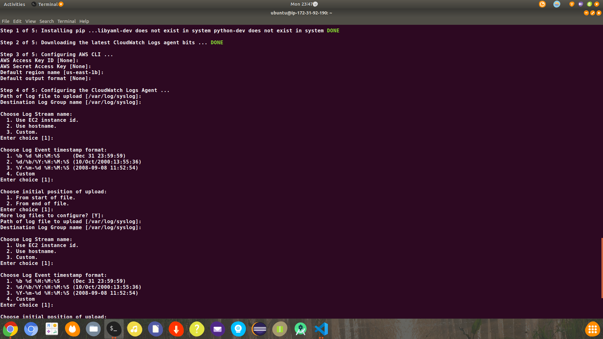

# Part two: Monitoring EC2 logs

<!--Write about EC2 logs-->

## 2.1 Configuring IAM role

## 2.2 Setting up awslogs for the instance

## 2.3 Attaching IAM role to the EC2 instance

## 2.4 Performing operations on logs

